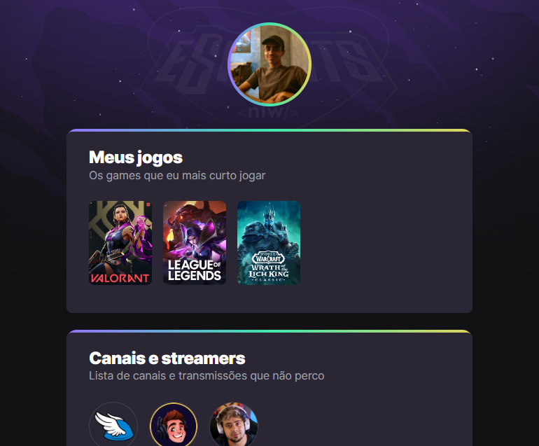

# NLW eSports

> 🧗‍♂️ Trilha Explorer   

Projeto construído durante o evento com duração de uma semana Next Level Week, da rocketseat.

🔗[Clique aqui para acessar.](https://lucasaalv.github.io/nlw/NLW/)

## 💻 - Tecnologias que utilizei:

- HTML
- CSS
- Git e Github

## 🤓 O que aprendi:

- Boas praticas na estruturação do HTML.
- Boas praticas na estruturação do CSS.
- Novas animações com CSS.
- Novas ferramentas do github e git.

## 📩 Meu contato:

- alveslucasw@gmail.com